# DonJ Custom NPC Placer

<p align="center">
  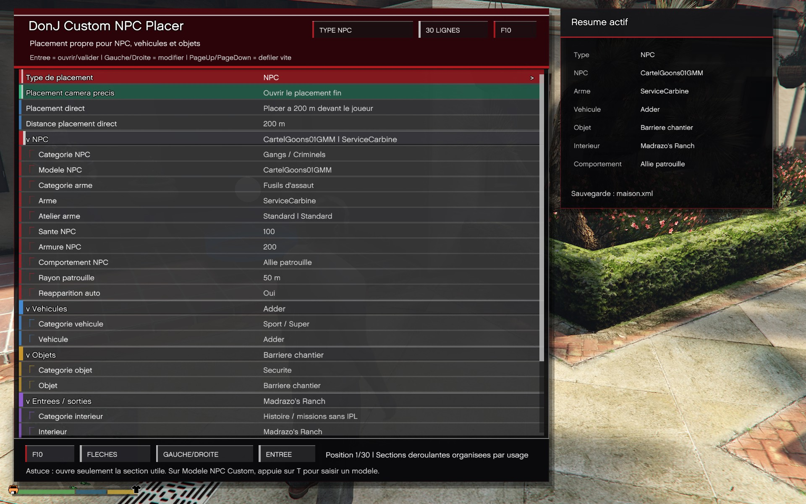
</p>

<p align="center">
  <strong>Un outil solo pour construire des scènes GTA V Enhanced propres, armées et rejouables.</strong>
</p>

<p align="center">
  <a href="#installation"><strong>Installation</strong></a>
  ·
  <a href="#utilisation"><strong>Utilisation</strong></a>
  ·
  <a href="#fonctionnalités-principales"><strong>Fonctionnalités</strong></a>
  ·
  <a href="#build-depuis-le-code-source"><strong>Build source</strong></a>
  ·
  <a href="#signaler-un-bug"><strong>Signaler un bug</strong></a>
</p>

<p align="center">
  
  
  
  
  
  
</p>

> [!IMPORTANT]
> **Statut du projet : le mod est fonctionnel et utilisable en jeu.**
> Il reste en développement actif pour être perfectionné, améliorer l’expérience, corriger les limites connues et ajouter des finitions, mais la base actuelle marche déjà en mode histoire.

**DonJ Custom NPC Placer** permet de créer rapidement des scènes personnalisées dans Los Santos : PNJ armés, gardes, patrouilles, alliés, véhicules, objets, décors, entrées/sorties d’intérieurs, appel de renforts Cartel et sauvegardes XML réutilisables.

Le mod est pensé comme un outil de placement propre, pratique et immersif pour les joueurs qui veulent construire leurs propres bases, checkpoints, scènes d’action, zones sécurisées, missions maison ou setups roleplay en mode histoire.

> ⚠️ Ce mod est destiné au **mode solo / histoire uniquement**.  
> Ne l’utilisez pas dans GTA Online.

---

## En bref

| Ce que vous voulez faire | Ce que le mod apporte |
|---|---|
| Construire une base ou un checkpoint | Placement précis de PNJ, véhicules, objets et couvertures |
| Créer une zone gardée | PNJ alliés, neutres, hostiles, patrouilles et comportements de défense |
| Obtenir des renforts rapides | Contact téléphone `Cartel` avec convoi allié, Baller6 blindées et repli contrôlé |
| Travailler proprement | Caméra libre, aperçu transparent, rotation et placement direct |
| Réutiliser une scène | Sauvegarde et chargement XML des setups complets |
| Relier des lieux | Entrées/sorties d’intérieurs avec catalogue étendu et IPL automatiques |

---

## Aperçu visuel

<table>
  <tr>
    <td width="33%">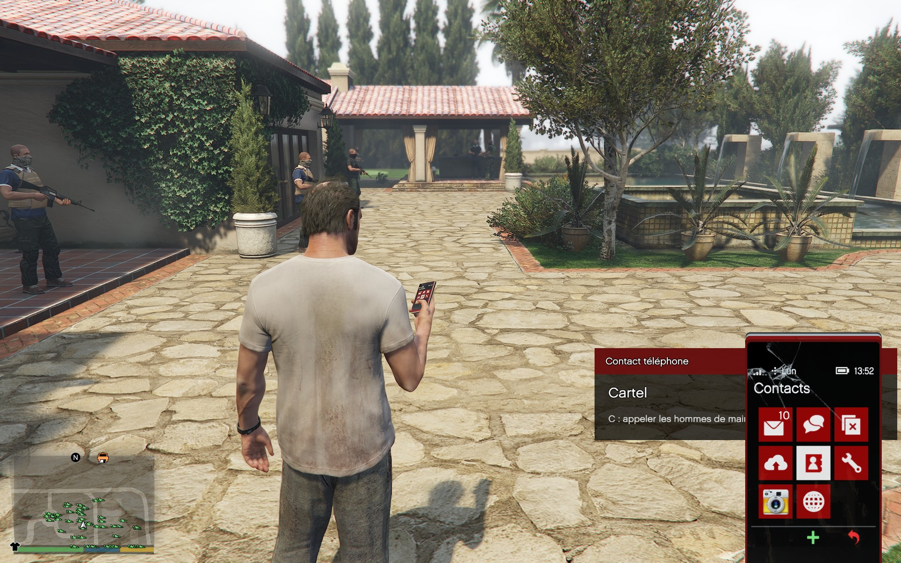</td>
    <td width="33%">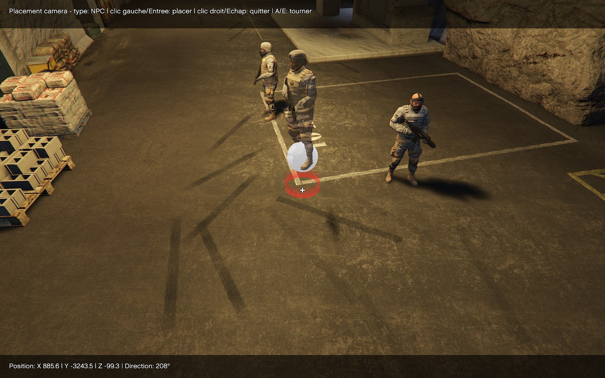</td>
    <td width="33%">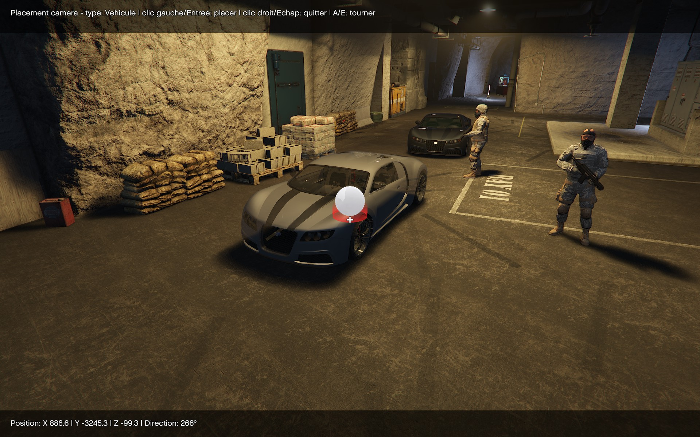</td>
  </tr>
  <tr>
    <td width="33%">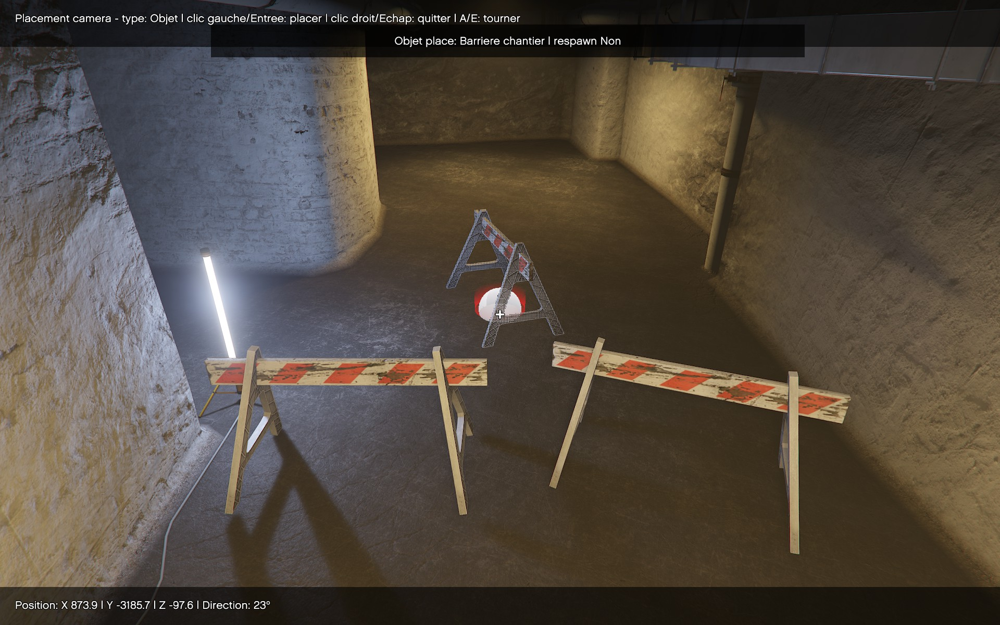</td>
    <td width="33%">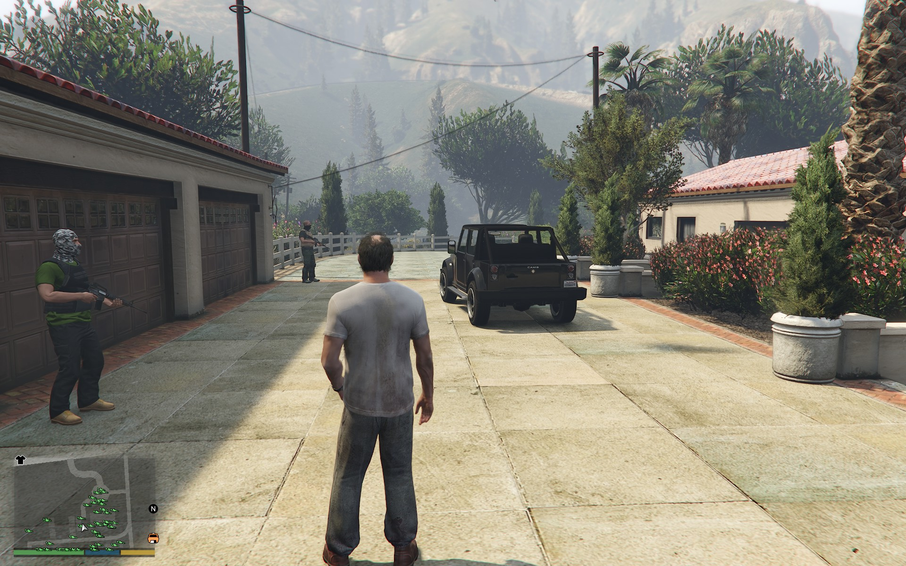</td>
    <td width="33%"></td>
  </tr>
  <tr>
    <td width="33%">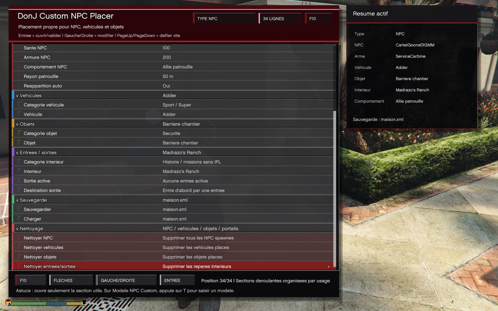</td>
    <td width="33%">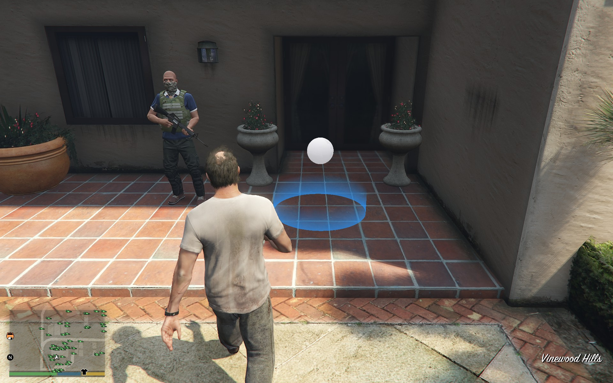</td>
    <td width="33%">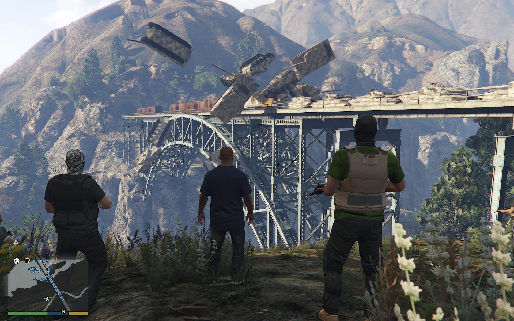</td>
  </tr>
</table>

---

## Sommaire

- [Fonctionnalités principales](#fonctionnalités-principales)
- [Installation](#installation)
- [Utilisation](#utilisation)
- [Exemple rapide](#exemple-rapide)
- [Sauvegardes](#sauvegardes)
- [Compatibilité](#compatibilité)
- [Build depuis le code source](#build-depuis-le-code-source)
- [Dépannage](#dépannage)
- [Licence](#licence)

---

## Fonctionnalités principales

### Placement de PNJ / NPC

Le mod permet de placer des PNJ directement dans le monde avec un menu intégré.

Vous pouvez choisir :

- le modèle du PNJ ;
- la catégorie du PNJ ;
- l’arme ;
- les accessoires d’arme ;
- la santé ;
- l’armure ;
- le comportement ;
- le rayon de patrouille ;
- la réapparition automatique.

Catégories de PNJ disponibles :

- Custom / Add-on ;
- Sécurité / Police / Militaire ;
- Gangs / Criminels ;
- Multiplayer / Online ;
- Services / Scénarios ;
- Civils hommes ;
- Civils femmes ;
- Story / Cutscene ;
- Animaux ;
- Tous les PNJ.

Le mod supporte aussi les modèles custom. Sélectionnez le modèle **Custom**, puis appuyez sur `T` pour entrer le nom du modèle.

---

### Comportements des PNJ

Chaque PNJ peut recevoir un comportement différent :

| Comportement | Description |
|---|---|
| Statique / hostile à vue | Le PNJ reste en position et devient hostile quand il détecte une menace. |
| Attaquer / agressif | Le PNJ attaque activement le joueur. |
| Neutre / garde passif | Le PNJ garde sa zone et réagit si une menace apparaît. |
| Allié / garde défense | Le PNJ défend le joueur contre les menaces proches. |
| Garde du corps / escorte joueur | Le PNJ suit le joueur à pied ou en véhicule. |
| Neutre patrouille | Le PNJ patrouille dans une zone sans attaquer immédiatement. |
| Hostile patrouille | Le PNJ patrouille et agit comme ennemi. |
| Allié patrouille | Le PNJ patrouille et aide le joueur en cas de combat. |

---

### Appel du Cartel

<p align="center">
  
  <br>
  <sub>Appel du Cartel depuis le téléphone du joueur : ouvrez le téléphone, puis appuyez sur <code>C</code> quand le contact <code>Cartel</code> est affiché.</sub>
</p>

<table>
  <tr>
    <td width="50%">
      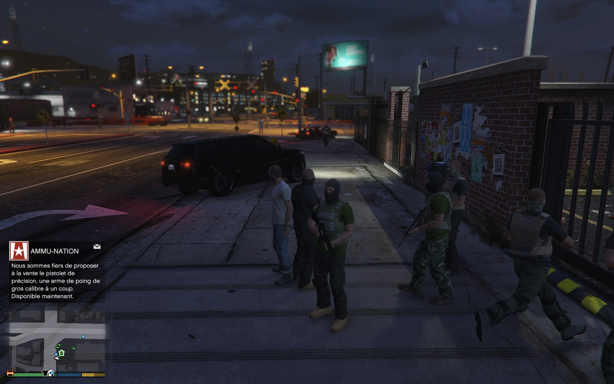
      <br>
      <sub>Appel confirme : 11 hommes arrivent rapidement en 3 Baller6 blindees.</sub>
    </td>
    <td width="50%">
      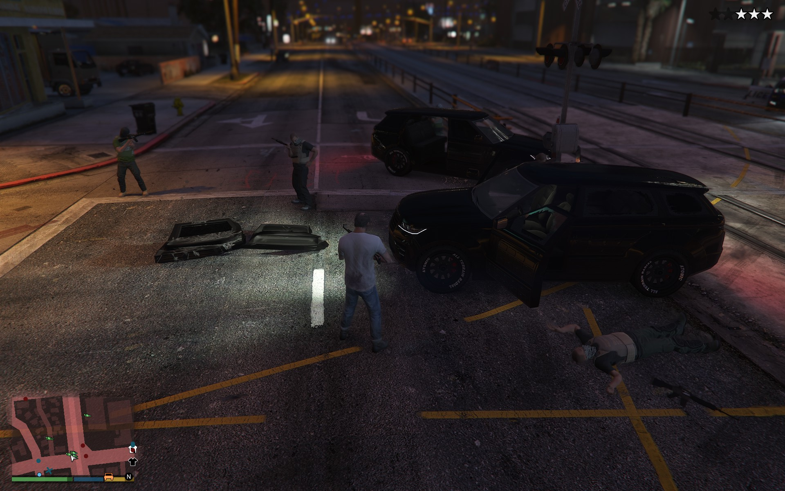
      <br>
      <sub>Les hommes de main rejoignent le joueur et prennent position.</sub>
    </td>
  </tr>
  <tr>
    <td width="50%">
      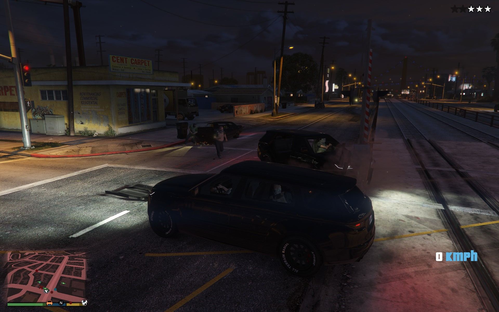
      <br>
      <sub>Baller6 blindees, protection rapprochee et riposte armee.</sub>
    </td>
    <td width="50%">
      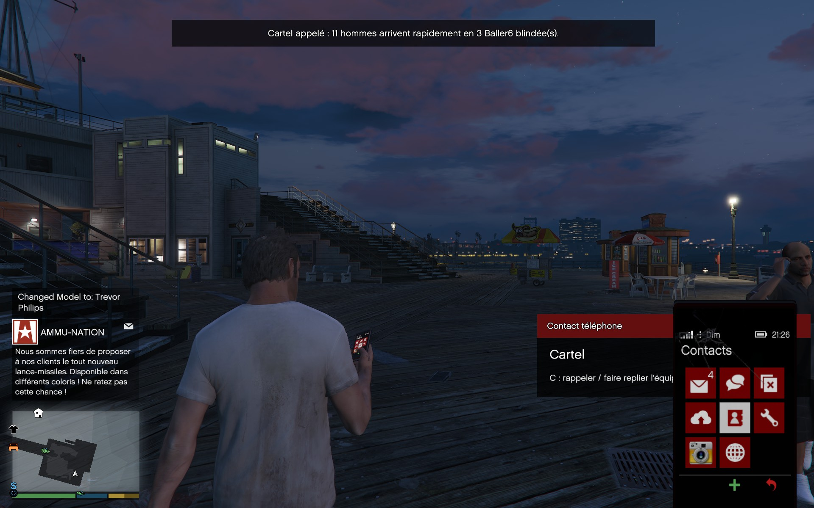
      <br>
      <sub>Convoi Cartel en mouvement pendant l'action.</sub>
    </td>
  </tr>
</table>

Le mod ajoute un contact téléphone **Cartel** utilisable directement en jeu.

Quand le téléphone du joueur est ouvert, une interface `Contact téléphone` apparaît avec le contact `Cartel`. Appuyez sur `C` pour appeler une équipe de protection.

L’appel fait arriver rapidement :

- jusqu’à 11 hommes de main alliés ;
- jusqu’à 3 Baller6 blindées ;
- des gardes équipés pour le combat, avec carabine de service et pistolet-mitrailleur ;
- des gardes renforcés avec `500` points de santé et `200` points d’armure.

Le convoi apparaît à distance raisonnable, généralement entre `68 m` et `118 m`, en priorité sur une route et hors du champ de vision du joueur pour garder une arrivée immersive.

Comportement du Cartel :

- si le joueur est à pied, les véhicules approchent puis les hommes descendent pour le suivre ;
- si le joueur est en véhicule, les hommes remontent dans les Baller6 et escortent le joueur ;
- en cas de menace réelle, les gardes défendent le joueur ou les autres gardes Cartel ;
- les passagers peuvent tirer depuis le véhicule ou descendre selon la situation ;
- les véhicules bloqués peuvent être réordonnés ou replacés hors champ de vision si le joueur s’éloigne trop.

Rappeler le Cartel pendant qu’une équipe est active ordonne son repli. Les hommes restent alliés, retournent vers les véhicules, quittent le secteur puis sont nettoyés automatiquement quand ils sont assez loin ou hors champ.

Vous pouvez appeler une nouvelle équipe même si une ancienne équipe est encore en train de quitter la zone.

---

### Atelier d’armes

Le mod inclut un atelier d’armes pour personnaliser l’équipement des PNJ.

Options disponibles selon l’arme :

- chargeur étendu ;
- silencieux ;
- lampe ;
- poignée ;
- lunette ;
- compensateur / bouche ;
- canon amélioré ;
- munitions MK2 ;
- teinte ;
- presets rapides ;
- application aux PNJ déjà placés.

Les composants incompatibles avec une arme sont ignorés proprement.

---

### Placement de véhicules

Vous pouvez placer des véhicules dans le monde avec aperçu et rotation.

Catégories disponibles :

- Sport / Super ;
- Berlines / Coupes ;
- SUV / 4x4 ;
- Motos ;
- Police / Secours ;
- Militaire ;
- Utilitaires / Vans ;
- Camions ;
- Avions / Hélicos ;
- Bateaux ;
- Tous les véhicules.

---

### Placement d’objets

Le mod permet aussi de poser des objets pour construire des décors, des couvertures, des checkpoints ou des zones de combat.

Catégories disponibles :

- Sécurité ;
- Couverture / Combat ;
- Mobilier ;
- Caisses / Stockage ;
- Décoration ;
- Lumières ;
- Extérieur ;
- Divers.

Exemples d’objets inclus :

- cônes ;
- barrières ;
- blocs béton ;
- bennes ;
- palettes ;
- chaises ;
- tables ;
- caisses ;
- lampes ;
- tentes ;
- sacs ;
- extincteurs ;
- objets de décoration.

---

### Intérieurs et portails

Le mod inclut un système d’entrées et de sorties vers des intérieurs.

> [!WARNING]
> **Fonctionnalité expérimentale.** Les entrées/sorties d’intérieurs peuvent encore occasionner des bugs selon l’intérieur choisi, les IPL chargés ou le contexte de jeu.
> Le placement de gardes ou de PNJ dans certains intérieurs peut aussi provoquer des comportements imprévus, notamment sur la navigation, le combat, le suivi, le spawn ou le nettoyage. La fonctionnalité marche, mais cette partie est encore en cours de perfectionnement.

Vous pouvez placer :

- une **entrée** dans le monde extérieur ;
- une **sortie** dans l’intérieur actif ;
- des marqueurs permettant de voyager entre les deux.

Le catalogue contient plus de 150 emplacements d’intérieurs, dont :

- bunkers ;
- facilities ;
- appartements online ;
- garages ;
- maisons ;
- bureaux CEO ;
- business ;
- Diamond Casino & Resort ;
- lieux de missions ;
- lieux spéciaux avec IPL.

Le mod charge les IPL nécessaires quand l’intérieur en a besoin.

---

### Placement caméra précis

Le placement caméra permet de poser précisément un PNJ, un véhicule, un objet ou un portail.

Pendant le placement :

- le joueur est figé ;
- le joueur est protégé ;
- une caméra libre est activée ;
- un aperçu transparent de l’entité est affiché ;
- la rotation peut être ajustée avant validation.

C’est le mode recommandé pour créer des scènes propres.

---

### Placement direct

Le placement direct permet de poser rapidement l’élément sélectionné devant le joueur.

La distance est configurable de `25 m` à `2500 m`, par pas de `25 m`.

---

### Sauvegarde et chargement XML

Le mod peut sauvegarder et recharger vos setups.

Les sauvegardes XML contiennent :

- les PNJ ;
- les modèles custom ;
- les armes ;
- les accessoires d’armes ;
- les comportements ;
- la santé ;
- l’armure ;
- les véhicules ;
- les objets ;
- les entrées/sorties d’intérieurs ;
- les options de réapparition automatique.

Le nom de sauvegarde par défaut est :

```text
maison.xml
```

Vous pouvez le modifier depuis le menu du mod.

---

## Installation

### Prérequis

Avant d’installer le mod, vous devez avoir :

- GTA V Enhanced sur Windows x64 ;
- [ScriptHookV](https://www.dev-c.com/gtav/scripthookv/) installé ;
- `dinput8.dll` dans le dossier principal du jeu ;
- `ScriptHookV.dll` dans le dossier principal du jeu ;
- [`NIBScriptHookVDotNet.asi`](https://www.patreon.com/posts/nibmods-menu-and-22783974) installé ;
- [`NIBScriptHookVDotNet2.dll`](https://www.patreon.com/posts/nibmods-menu-and-22783974) installé ;
- un dossier `Scripts` dans le dossier principal du jeu.

Le mod cible l’API v2 de ScriptHookVDotNet via NIBScriptHookVDotNet.

Liens utiles :

| Prérequis | Lien de téléchargement | Où copier les fichiers |
|---|---|---|
| `ScriptHookV.dll` et `dinput8.dll` | [Script Hook V officiel - Alexander Blade](https://www.dev-c.com/gtav/scripthookv/) | Dossier principal de GTA V Enhanced, au même niveau que `GTA5_Enhanced.exe` |
| `NIBScriptHookVDotNet.asi` et `NIBScriptHookVDotNet2.dll` | [NIBMods Menu and .Net plugins - GTA Legacy and Enhanced - JulioNIB](https://www.patreon.com/posts/nibmods-menu-and-22783974) | Dossier principal de GTA V Enhanced, au même niveau que `GTA5_Enhanced.exe` |

Pour GTA V Enhanced, téléchargez l’archive **GTA Enhanced** du post JulioNIB, puis suivez le fichier d’aide inclus dans l’archive.

Configuration testée :

```text
GTA5_Enhanced.exe 1.0.1013.34
ScriptHookV.dll 3788.0.1013.34
NIBScriptHookVDotNet2.dll 2.11.6
Windows x64
.NET Framework 4.8
```

Les autres versions peuvent fonctionner, mais ne sont pas garanties.

---

### Installation depuis une release GitHub

1. Téléchargez la dernière release du mod.
2. Ouvrez le `.zip`.
3. Copiez ce fichier :

```text
DonJCustomNpcPlacer.ENdll
```

dans le dossier :

```text
Grand Theft Auto V Enhanced\Scripts
```

Exemple Steam :

```text
C:\Program Files (x86)\Steam\steamapps\common\Grand Theft Auto V Enhanced\Scripts
```

4. Vérifiez que le fichier est bien présent ici :

```text
Grand Theft Auto V Enhanced\Scripts\DonJCustomNpcPlacer.ENdll
```

5. Lancez GTA V Enhanced en mode histoire.
6. Appuyez sur `F10` pour ouvrir le menu.

---

### Fichier `.pdb`

Certaines releases peuvent contenir aussi :

```text
DonJCustomNpcPlacer.pdb
```

Ce fichier est optionnel. Il sert surtout au debug et aux logs plus lisibles.

Vous pouvez le copier dans `Scripts` avec le `.ENdll`, mais ce n’est pas obligatoire pour jouer.

---

### Mise à jour

Pour mettre le mod à jour :

1. Fermez le jeu.
2. Supprimez l’ancien fichier :

```text
Scripts\DonJCustomNpcPlacer.ENdll
```

3. Copiez le nouveau fichier `DonJCustomNpcPlacer.ENdll`.
4. Relancez le jeu.

Si vous aviez une ancienne version du mod, supprimez aussi les anciens fichiers éventuels :

```text
Scripts\DonJEnemySpawner.dll
Scripts\DonJEnemySpawner.ENdll
Scripts\DonJEnemySpawner.pdb
```

Cela évite que deux versions du script se chargent en même temps.

---

### Désinstallation

Pour désinstaller le mod :

1. Fermez le jeu.
2. Supprimez :

```text
Scripts\DonJCustomNpcPlacer.ENdll
Scripts\DonJCustomNpcPlacer.pdb
```

3. Les sauvegardes peuvent être supprimées séparément si vous ne voulez plus les garder.

---

## Utilisation

### Ouvrir le menu

En jeu, appuyez sur :

```text
F10
```

Le menu principal s’ouvre avec plusieurs sections :

- Type de placement ;
- NPC ;
- Véhicule ;
- Objet ;
- Intérieur ;
- Sauvegarde ;
- Nettoyage.

---

### Contrôles du menu

| Touche | Action |
|---|---|
| `F10` | Ouvrir / fermer le menu |
| `↑` / `↓` | Naviguer |
| `NumPad 8` / `NumPad 2` | Naviguer |
| `←` / `→` | Modifier une valeur |
| `NumPad 4` / `NumPad 6` | Modifier une valeur |
| `Entrée` | Valider / ouvrir une action |
| `NumPad 5` | Valider / ouvrir une action |
| `PageUp` / `PageDown` | Défiler rapidement |
| `Home` / `End` | Aller au début / à la fin |
| `Échap` / `Retour` / `NumPad 0` | Fermer ou revenir |
| `T` | Saisir un modèle custom quand le modèle NPC sélectionné est `Custom` |

---

### Contrôles du contact Cartel

| Touche / état | Action |
|---|---|
| Téléphone du joueur ouvert | Affiche le contact `Cartel` |
| `C` | Appeler les hommes de main du Cartel |
| `C` avec une équipe Cartel active | Faire replier l’équipe active |

Un court délai anti-spam empêche de relancer l’appel plusieurs fois instantanément.

---

### Contrôles du placement caméra

Quand vous lancez un placement caméra précis :

| Touche / action | Effet |
|---|---|
| Souris | Regarder autour |
| `Z` ou `W` | Avancer |
| `S` | Reculer |
| `Q` | Aller à gauche |
| `D` | Aller à droite |
| `Espace` | Monter |
| `Ctrl` | Descendre |
| `Shift` | Déplacement rapide |
| `Alt` | Déplacement lent |
| `A` / `E` | Tourner l’entité placée |
| Clic gauche | Placer |
| `Entrée` | Placer |
| `NumPad 5` | Placer |
| Clic droit | Quitter le placement |
| `Échap` | Quitter le placement |
| `Retour` | Quitter le placement |

---

## Exemple rapide

### Créer un checkpoint hostile

1. Appuyez sur `F10`.
2. Choisissez `Type de placement : NPC`.
3. Ouvrez la section `NPC`.
4. Sélectionnez une catégorie, par exemple `Sécurité / Police / Militaire`.
5. Choisissez un modèle, par exemple un SWAT.
6. Choisissez une arme.
7. Réglez le comportement sur `Hostile patrouille` ou `Statique / hostile à vue`.
8. Réglez la santé, l’armure et le rayon de patrouille.
9. Lancez `Placement camera précis`.
10. Placez le PNJ avec `Entrée` ou clic gauche.
11. Répétez pour créer plusieurs gardes.
12. Sauvegardez avec `Sauvegarder`.

---

### Créer une base gardée

1. Placez des objets de couverture.
2. Placez des véhicules.
3. Placez des PNJ neutres ou alliés.
4. Ajoutez des patrouilles.
5. Ajoutez une entrée vers un intérieur.
6. Placez une sortie dans l’intérieur.
7. Sauvegardez le setup.

---

## Sauvegardes

Le mod crée automatiquement un dossier de sauvegarde.

Le dossier prioritaire est généralement :

```text
Grand Theft Auto V Enhanced\Scripts\DonJEnemySpawnerSaves
```

Si ce dossier n’est pas accessible en écriture, le mod peut utiliser un dossier de secours, par exemple :

```text
Documents\Rockstar Games\GTA V Enhanced\DonJEnemySpawnerSaves
```

ou :

```text
%LOCALAPPDATA%\DonJEnemySpawner\Saves
```

Vous pouvez aussi forcer un dossier de sauvegarde personnalisé avec la variable d’environnement :

```text
DONJ_ENEMY_SPAWNER_SAVE_DIR
```

---

## Nettoyage en jeu

Le menu contient une section `Nettoyage`.

Elle permet de supprimer séparément :

- les PNJ placés ;
- les véhicules placés ;
- les objets placés ;
- les entrées/sorties d’intérieurs.

---

## Compatibilité

Ce mod est prévu pour :

```text
GTA V Enhanced
Windows x64
Mode histoire / solo
NIBScriptHookVDotNet API v2
.NET Framework 4.8
```

Non garanti pour :

- GTA Online ;
- FiveM ;
- RageMP ;
- anciennes versions non Enhanced ;
- installations sans NIBScriptHookVDotNet2 ;
- versions piratées ou modifiées du jeu.

---

## Build depuis le code source

Le projet cible :

```text
.NET Framework 4.8
```

Commande de build :

```powershell
dotnet build GTA5modDEV.sln -c Release
```

Commande de test :

```powershell
dotnet test GTA5modDEV.sln -c Release
```

Le fichier généré se trouve ici :

```text
src\DonJEnemySpawner\bin\Release\DonJCustomNpcPlacer.ENdll
```

En configuration `Release`, le projet peut aussi déployer automatiquement le fichier vers le dossier `Scripts` si le chemin GTA est correctement détecté.

Pour forcer un dossier GTA personnalisé :

```powershell
dotnet build GTA5modDEV.sln -c Release /p:GtaRoot="D:\Jeux\Grand Theft Auto V Enhanced"
```

---

## Dépannage

### Le menu ne s’ouvre pas avec F10

Vérifiez que :

- vous êtes en mode histoire ;
- `DonJCustomNpcPlacer.ENdll` est bien dans le dossier `Scripts` ;
- `NIBScriptHookVDotNet.asi` est installé ;
- `NIBScriptHookVDotNet2.dll` est installé ;
- `ScriptHookV.dll` est compatible avec votre version du jeu ;
- aucun ancien fichier `DonJEnemySpawner.dll` ou `DonJEnemySpawner.ENdll` n’est encore présent.

---

### Le mod ne se charge pas

Consultez les logs suivants :

```text
Grand Theft Auto V Enhanced\NIBScriptHookVDotNet.log
Grand Theft Auto V Enhanced\ScriptHookV.log
Grand Theft Auto V Enhanced\Scripts\*.log
```

Si vous utilisez d’autres mods, vérifiez aussi leurs logs éventuels.

---

### Un modèle custom n’apparaît pas

Vérifiez que :

- le modèle add-on est bien installé ;
- son nom est exact ;
- le modèle est chargeable par le jeu ;
- vous avez bien sélectionné `Custom` dans le menu NPC ;
- vous avez appuyé sur `T` pour entrer le nom du modèle.

---

### Une sauvegarde ne se crée pas

Vérifiez que le dossier `Scripts` est accessible en écriture.

Si Windows bloque l’écriture dans le dossier du jeu, utilisez un dossier de sauvegarde personnalisé avec :

```text
DONJ_ENEMY_SPAWNER_SAVE_DIR
```

---

## Signaler un bug

Pour signaler un problème, ouvrez une issue GitHub avec :

- votre version de GTA V Enhanced ;
- votre version de ScriptHookV ;
- votre version de NIBScriptHookVDotNet ;
- une description précise du bug ;
- les étapes pour reproduire ;
- les fichiers de logs utiles ;
- une capture d’écran si possible.

Logs utiles :

```text
NIBScriptHookVDotNet.log
ScriptHookV.log
Scripts\*.log
menyooLog.txt
```

---

## Crédits

Mod développé par l’équipe DonJ.

Projet C# / .NET Framework 4.8 pour GTA V Enhanced, basé sur ScriptHookV et NIBScriptHookVDotNet API v2.

---

## Licence

Ce projet est distribué sous une licence personnalisée propriétaire et non commerciale.

Vous pouvez utiliser le mod gratuitement en mode solo, consulter le code source et proposer des contributions, mais vous n’êtes pas autorisé à revendre, republier, redistribuer ou intégrer le mod dans un modpack sans autorisation écrite.

Voir le fichier [`LICENSE`](LICENSE) pour les conditions complètes.
