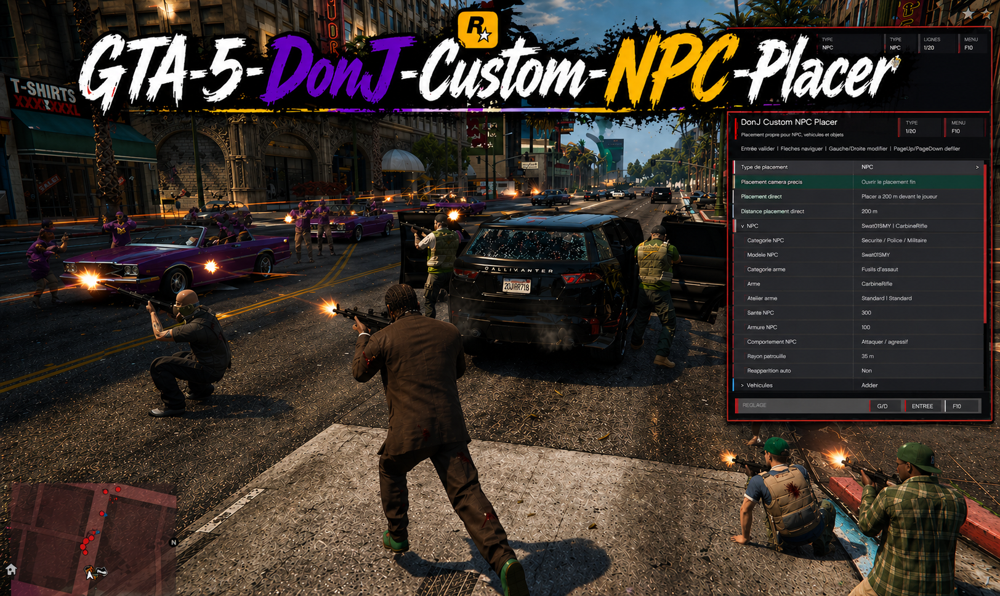
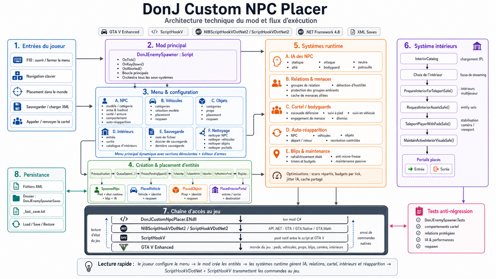
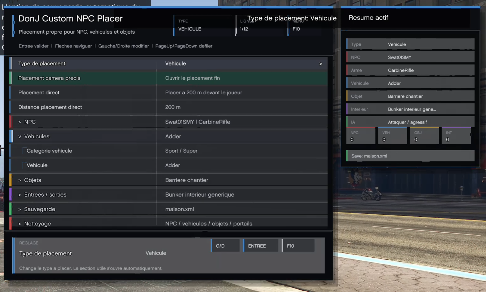
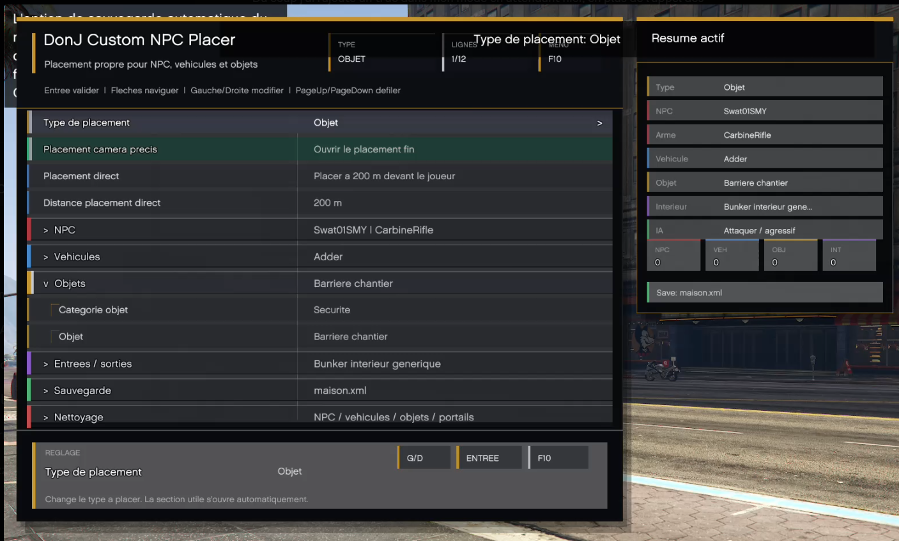
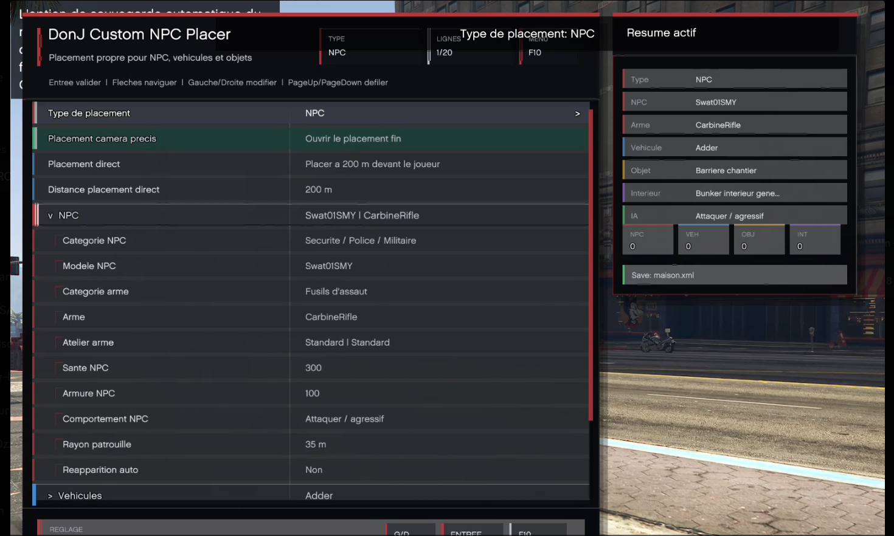
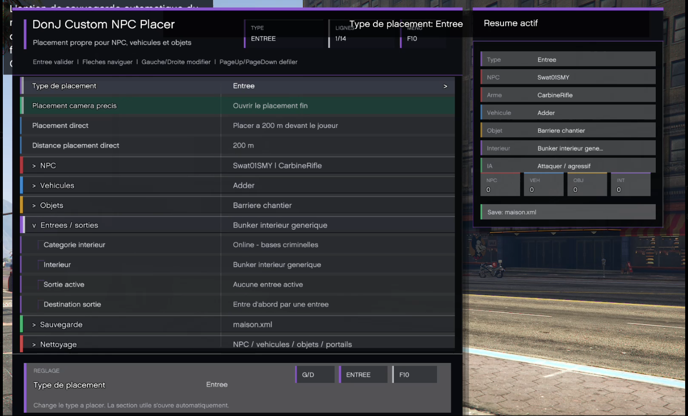
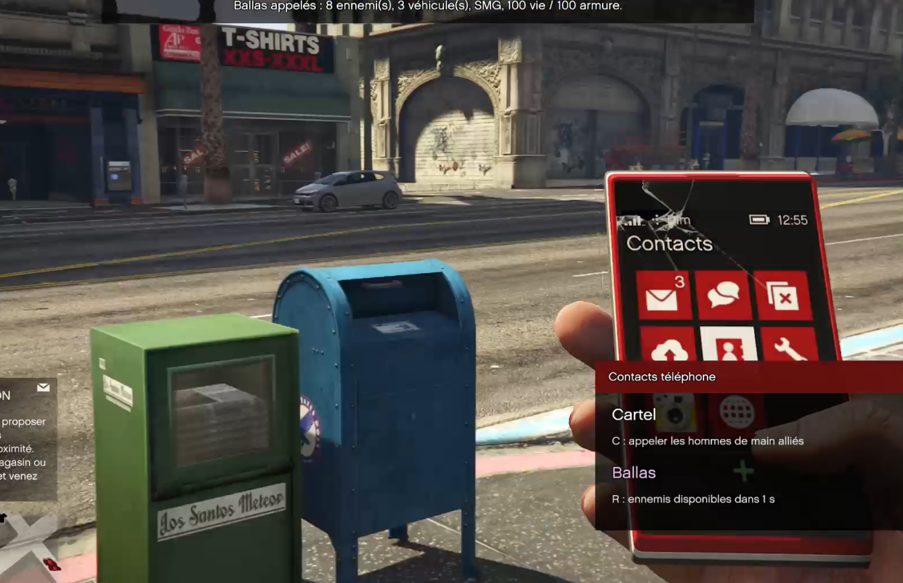
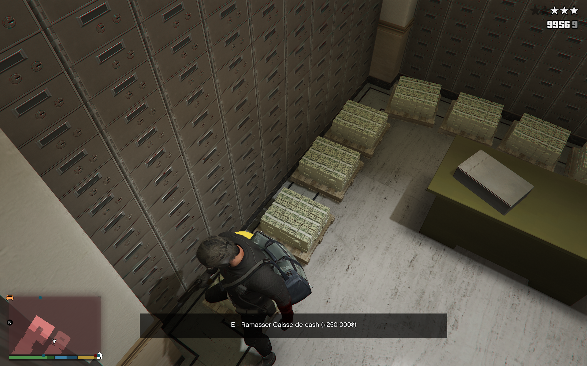
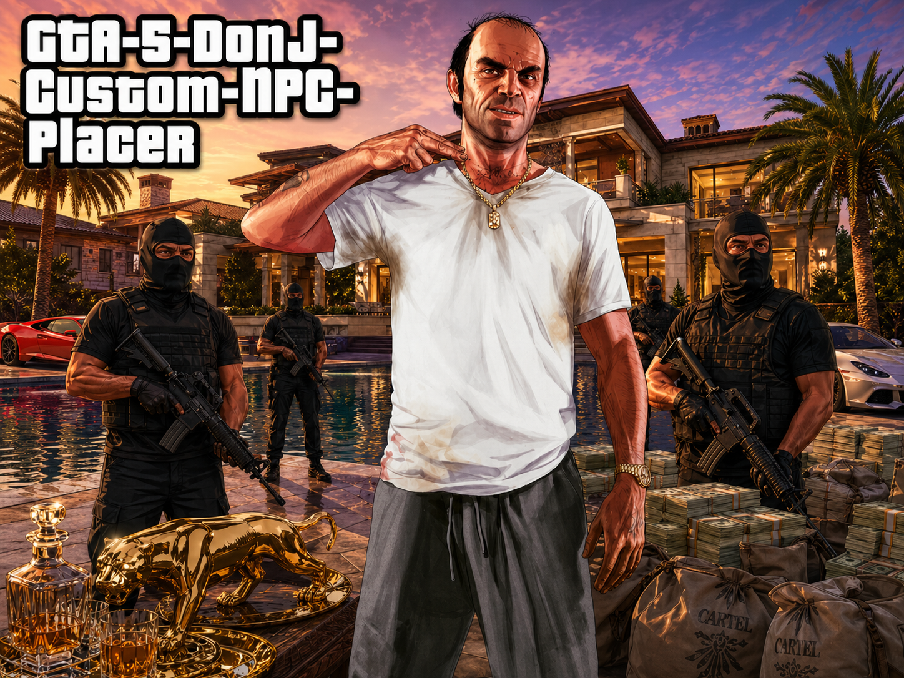

<h1 align="center">[GTA5 Enhanced] DonJ Custom NPC Placer </h1>

<p align="center">
  <strong>Solo scene creation tool for GTA V Enhanced</strong><br>
  <sub>NPCs, guards, patrols, respawn, Cartel, Ballas, high-security escort, vehicles, objects, interiors, and XML saves.</sub>
</p>

<p align="center">
  
</p>

## Table of Contents

- [Main Features](#main-features)
- [Respawn / Automatic Respawn](#respawn--automatic-respawn)
- [Installation](#installation)
- [Usage](#usage)
- [Quick Example](#quick-example)
- [Saves](#saves)
- [Compatibility](#compatibility)
- [Build from Source](#build-from-source)
- [Troubleshooting](#troubleshooting)
- [License](#license)

---

<p align="center">
  <strong>Build a base, a checkpoint, an action scene, or a roleplay setup directly in story mode.</strong>
</p>

<p align="center">
  <a href="#installation"><strong>Installation</strong></a>
  |
  <a href="#usage"><strong>Usage</strong></a>
  |
  <a href="#main-features"><strong>Features</strong></a>
  |
  <a href="#build-from-source"><strong>Source build</strong></a>
  |
  <a href="#report-a-bug"><strong>Report a bug</strong></a>
</p>

<p align="center">
  
  
  
  
  
  
</p>

> [!IMPORTANT]
> **Project status: the mod is functional and usable in game.**
> It is still in active development so it can be refined, improve the experience, fix known limits, and add polish, but the current base already works in story mode.

<table>
  <tr>
    <td width="58%">
      <strong>Overview</strong>
      <br><br>
      <strong>DonJ Custom NPC Placer</strong> lets you quickly create custom scenes in Los Santos: <strong>armed NPCs</strong>, <strong>guards</strong>, <strong>patrols</strong>, <strong>allies</strong>, <strong>vehicles</strong>, <strong>objects</strong>, <strong>props</strong>, <strong>collectible cash</strong>, <strong>interior entrances/exits</strong>, <strong>Cartel reinforcement calls</strong>, <strong>hostile Ballas calls</strong>, <strong>high-security armored convoy escort</strong>, and <strong>reusable XML saves</strong>.
      <br><br>
      The mod is designed as a clean, practical, and immersive placement tool for players who want to build their own bases, checkpoints, action scenes, secured zones, homemade missions, or roleplay setups in story mode.
    </td>
    <td width="42%">
      <strong>Highlights</strong>
      <br><br>
      <ul>
        <li><strong>Precise placement</strong> with free camera and transparent preview.</li>
        <li><strong>Configurable NPCs</strong> with weapons, health, armor, behaviors, and respawn.</li>
        <li><strong>Phone contacts</strong>: Cartel with <code>C</code>, Ballas with <code>R</code>, high-security escort with <code>L</code>.</li>
        <li><strong>Collectible cash</strong> with several amounts for rewarding zones and missions.</li>
        <li><strong>Persistent scenes</strong> with automatic respawn and XML saves.</li>
      </ul>
    </td>
  </tr>
</table>

## How the Mod Works

<p align="center">
  
</p>

The mod runs directly **inside GTA V Enhanced**, with no separate application to open.

| Step | What happens |
|---|---|
| **1. The game loads the mod** | When story mode starts, `ScriptHookV` and `NIBScriptHookVDotNet2` load `DonJCustomNpcPlacer.ENdll` from the `Scripts` folder. |
| **2. You open the menu** | In game, `F10` opens the DonJ menu. You choose what you want to place: NPC, vehicle, object, interior entrance/exit, or save options. |
| **3. You configure the scene** | You set the model, weapon, health, armor, behavior, patrol, respawn, vehicle, or object to place. |
| **4. You place it in the world** | Direct placement quickly places the item in front of the player. Camera placement lets you aim precisely, rotate the entity, and validate when it is clean. |
| **5. The mod manages the scene** | After placement, the mod maintains NPCs, their behaviors, blips, relationships, threats, patrols, bodyguards, the Cartel, the Ballas, the high-security escort, and respawn. |
| **6. You save / reload** | Setups can be saved as XML and reloaded later to restore NPCs, vehicles, objects, portals, weapons, behaviors, and respawn options. |

In short: **you build the scene with the menu**, then the mod keeps the placed elements alive in game.

> [!CAUTION]
> **Story mode / single-player only.** Do not use this mod in GTA Online.

---

## At a Glance

<table>
  <tr>
    <td width="33%"><strong>Base or checkpoint</strong><br>Precise placement of NPCs, vehicles, objects, and cover.</td>
    <td width="33%"><strong>Guarded zone</strong><br>Allied, neutral, and hostile NPCs, patrols, defense, and respawn.</td>
    <td width="33%"><strong>Fast contacts</strong><br><code>C</code> for allied Cartel, <code>R</code> for hostile Ballas, <code>L</code> for a VIP armored escort.</td>
  </tr>
  <tr>
    <td width="33%"><strong>Clean placement</strong><br>Free camera, transparent preview, rotation, and direct placement.</td>
    <td width="33%"><strong>Persistent scenes</strong><br>Automatic respawn and XML loading for complete setups.</td>
    <td width="33%"><strong>Interiors</strong><br>Entrances/exits, extended catalog, and automatic IPL loading.</td>
  </tr>
  <tr>
    <td width="33%"><strong>Collectible loot</strong><br>Cash stacks, bags, briefcases, crates, and cash trolleys with different values.</td>
    <td width="33%"><strong>Mission rewards</strong><br>Cash objects to place in a safehouse, vault, office, or searchable zone.</td>
    <td width="33%"><strong>Gameplay value</strong><br>The player can collect cash with <code>E</code>, then the object disappears from the scene.</td>
  </tr>
</table>

---

## New Category UI

<table>
  <tr>
    <td width="50%"></td>
    <td width="50%"></td>
  </tr>
  <tr>
    <td width="50%"></td>
    <td width="50%"></td>
  </tr>
</table>

## Main Features

### NPC Placement

The mod lets you place NPCs directly in the world with an integrated menu.

You can choose:

- the NPC model;
- the NPC category;
- the weapon;
- weapon attachments;
- health;
- armor;
- behavior;
- patrol radius;
- automatic respawn.

Available NPC categories:

- Custom / Add-on;
- Security / Police / Military;
- Gangs / Criminals;
- Multiplayer / Online;
- Services / Scenarios;
- Male civilians;
- Female civilians;
- Story / Cutscene;
- Animals;
- All NPCs.

The mod also supports custom models. Select the **Custom** model, then press `T` to enter the model name.

---

### NPC Behaviors

Each NPC can receive a different behavior:

| Behavior | Description |
|---|---|
| Static / hostile on sight | The NPC stays in position and becomes hostile when it detects a threat. |
| Attack / aggressive | The NPC actively attacks the player. |
| Neutral / passive guard | The NPC guards its area and reacts if a threat appears. |
| Ally / defense guard | The NPC defends the player against nearby threats. |
| Bodyguard / player escort | The NPC follows the player on foot or in a vehicle. |
| Neutral patrol | The NPC patrols an area without attacking immediately. |
| Hostile patrol | The NPC patrols and acts as an enemy. |
| Allied patrol | The NPC patrols and helps the player in combat. |

---

### Respawn / Automatic Respawn

> [!TIP]
> **Automatic respawn** is one of the most practical features for creating a base, checkpoint, or combat scene that stays usable for a long time.

Respawn lets a placed element **automatically reappear** after it has been killed, destroyed, or removed by the game.

It can be used to:

- restore **guards** after a fight;
- recreate **enemy or allied patrols**;
- bring back a **placed vehicle** if it explodes or disappears;
- restore a **decorative or cover object** if the game removes it;
- keep a base or checkpoint alive even after several attacks.

To use it:

1. Open the menu with `F10`.
2. Enable **Automatic respawn** before placing the element.
3. Place your NPC, vehicle, or object normally.
4. Save your setup if you want to keep this option in the XML file.

When respawn is enabled, the mod remembers the placed element's **original position**, **rotation**, **model**, equipment, and important settings.

Then, if the element disappears:

- the mod waits a short delay before recreating it;
- the player must have moved away from the area;
- the mod avoids spawning the element directly in front of the player;
- if the game refuses the spawn at that moment, the mod automatically tries again later.

In practice, this creates a cleaner scene: guards, vehicles, and objects do not brutally reappear in front of you. They mainly come back when you have left the area or when the respawn point is no longer visible, which preserves immersion.

> [!NOTE]
> Respawn is not meant to replace combat second by second in real time. If you stay in the same place while looking at the spawn point, the mod may wait before recreating the element to avoid a spawn that is too visible.

---

### Phone Calls C / R / L

<p align="center">
  
</p>

The phone lets you quickly launch three types of in-game activity: `C` calls allied Cartel protection, `R` triggers a hostile Ballas wave to create combat around the scene, and `L` calls a high-security escort with a limousine and armored convoy.

### Cartel Call

<table>
  <tr>
    <td width="50%">
      
    </td>
    <td width="50%">
      
    </td>
  </tr>
  <tr>
    <td width="50%">
      
    </td>
    <td width="50%">
      
    </td>
  </tr>
</table>

The mod adds a **Cartel** phone contact that can be used directly in game.

When the player's phone is open, a `Phone contact` interface appears with the `Cartel` contact. Press `C` to call a protection team.

The call quickly brings in:

- up to 11 allied gunmen;
- up to 3 armored Baller6 vehicles;
- guards equipped for combat, with a Service Carbine and Machine Pistol;
- reinforced guards with `500` health and `200` armor.

The convoy appears at a reasonable distance, usually between `68 m` and `118 m`, preferably on a road and outside the player's field of view to keep the arrival immersive.

Cartel behavior:

- if the player is on foot, the vehicles approach and the men get out to follow;
- if the player is in a vehicle, the men get back into the Baller6 vehicles and escort the player;
- if there is a real threat, the guards defend the player or the other Cartel guards;
- passengers can shoot from the vehicle or get out depending on the situation;
- blocked vehicles can be reordered or moved out of view if the player gets too far away.
- the system is coded so your bodyguards eventually find you again as much as possible, as long as you are on a road or close to a usable road. If they are too far away, the mod can move them closer to the player, but out of view and never too close, to keep the illusion that they are really arriving instead of appearing in front of you.

Calling the Cartel again while a team is active orders it to withdraw. The men remain allied, return to the vehicles, leave the area, and are automatically cleaned up when they are far enough away or out of view.

You can call a new team even if an older team is still leaving the area.

### Ballas Call

The mod also adds a hostile **Ballas** call that can be used from the player's phone.

When the phone is open, press `R` to trigger a Ballas wave around the player. This key is meant to quickly create activity in story mode: ambush, base attack, street shootout, pressure on a checkpoint, or a simple dynamic event around a scene you already prepared.

The Ballas arrive as armed enemies and look for a fight with the player. Unlike the Cartel, they are not allied reinforcements: the Ballas call is designed to make the area feel alive and hostile without manually placing every NPC.

---

### High-Security Escort

The mod adds a **High-security escort** contact that can be used from the player's phone with `L`.

When the player's phone is open, press `L` to call an allied VIP convoy. The team arrives with:

- an armored limousine to transport the player;
- `4` black high-security Baller vehicles in formation;
- reinforced Cartel guards with `500` health and `200` armor;
- a combat setup with Service Carbine and Machine Pistol;
- dedicated AI so generic NPC orders do not replace convoy orders.

The escort is useful for playing a secured transfer, extraction, VIP arrival, protected escape, or homemade mission with close protection.

Main flow:

1. Open the player's phone.
2. Press `L` to call the escort.
3. When the limousine arrives, move close to it and press `F` to get in the back.
4. Place a waypoint on the map.
5. Once seated in the back of the limousine, press `L` to validate the destination.
6. The convoy drives to the waypoint in formation.

During the trip, the limousine keeps following the route toward the destination. The Baller vehicles reposition around it, drivers avoid receiving useless orders every frame, and blocked vehicles can attempt a short reverse maneuver or an out-of-view reposition if needed.

During an ambush, guards react like a real escort:

- passengers can perform drive-by shooting;
- guards can get out if the threat is close or if the vehicle is blocked;
- the limousine keeps route priority while the player is on board;
- the Baller vehicles switch to a more aggressive driving style to protect and catch up with the convoy;
- hostile relationships are applied only to valid threats to avoid breaking ambient groups.

If you press `L` again from the phone while an escort is active, the mod orders a withdrawal. The vehicles leave the area, guards are cleaned up properly when they are far enough away or out of view, and you can call a new escort after the short anti-spam delay.

---

### Weapon Workshop

The mod includes a weapon workshop to customize NPC equipment.

Available options depending on the weapon:

- extended magazine;
- suppressor;
- flashlight;
- grip;
- scope;
- compensator / muzzle;
- improved barrel;
- MK2 ammunition;
- tint;
- quick presets;
- apply to already placed NPCs.

Components incompatible with a weapon are cleanly ignored.

---

### Vehicle Placement

You can place vehicles in the world with preview and rotation.

Available categories:

- Sport / Super;
- Sedans / Coupes;
- SUV / 4x4;
- Motorcycles;
- Police / Emergency;
- Military;
- Utility / Vans;
- Trucks;
- Planes / Helicopters;
- Boats;
- All vehicles.

---

### Object Placement

The mod also lets you place objects to build props, cover, checkpoints, or combat zones.

Available categories:

- Security;
- Cover / Combat;
- Cash / loot;
- Tactical gear;
- Health / survival;
- Office / IT;
- Workshop / tools;
- Furniture;
- Crates / Storage;
- Decoration;
- Lights;
- Exterior;
- Misc.

Included object examples:

- cones;
- barriers;
- concrete blocks;
- dumpsters;
- pallets;
- cash stacks;
- money bags;
- cash briefcases;
- cash crates;
- cash trolleys;
- chairs;
- tables;
- crates;
- lamps;
- tents;
- bags;
- fire extinguishers;
- decorative objects.

### Collectible Cash

<p align="center">
  
</p>

The **Cash / loot** category lets you place cash in your scenes: stacks, bills, envelopes, money bags, heist bags, briefcases, crates, gold safe, or cash trolley.

These objects give real value to the zones or missions you create. You can place a small stack in an office, a briefcase in a safehouse, a heist bag after a fight, or a big cash crate at the back of a bunker to reward exploration.

In game, the player approaches the object and presses `E` to collect it. The amount is added to the character's single-player cash, then the prop disappears and is no longer saved if you save the scene after taking it.

Amounts vary by object:

| Loot type | Indicative amount |
|---|---:|
| Single bill | `100$` |
| One-dollar bill | `1$` |
| Cash stack or pile | `10 000$` |
| Cash envelope | `2 500$` |
| Cash package | `5 000$` |
| Money bag, heist bag, or cash briefcase | `50 000$` |
| Cash trolley | `200 000$` |
| Cash crate or gold safe | `250 000$` |

Other objects remain decorative or useful depending on their type. Ammo packs, health kits, and armor objects can also become interactive when their model matches.

---

### Interiors and Portals

The mod includes a system for entrances and exits to interiors.

> [!WARNING]
> **Experimental feature.** Interior entrances/exits can still cause bugs depending on the selected interior, loaded IPLs, or game context.
> Placing guards or NPCs in some interiors can also cause unexpected behavior, especially around navigation, combat, following, spawning, or cleanup. The feature works, but this part is still being refined.

You can place:

- an **entrance** in the exterior world;
- an **exit** in the active interior;
- markers that allow travel between the two.

The catalog contains more than 150 interior locations, including:

- bunkers;
- facilities;
- online apartments;
- garages;
- houses;
- CEO offices;
- businesses;
- Diamond Casino & Resort;
- mission locations;
- special locations with IPLs.

The mod loads the required IPLs when an interior needs them.

---

### Precise Camera Placement

Camera placement lets you precisely place an NPC, vehicle, object, or portal.

During placement:

- the player is frozen;
- the player is protected;
- a free camera is enabled;
- a transparent preview of the entity is displayed;
- rotation can be adjusted before validation.

This is the recommended mode for creating clean scenes.

---

### Direct Placement

Direct placement lets you quickly place the selected element in front of the player.

The distance can be configured from `25 m` to `2500 m`, in `25 m` steps.

---

### XML Save and Load

The mod can save and reload your setups.

XML saves contain:

- NPCs;
- custom models;
- weapons;
- weapon attachments;
- behaviors;
- health;
- armor;
- vehicles;
- objects;
- interior entrances/exits;
- automatic respawn options.

The default save name is:

```text
maison.xml
```

You can change it from the mod menu.

---

## Installation

<p align="center">
  
</p>

> [!TIP]
> For the simplest setup, the repository contains a direct **`Mode-pour-jeu-ici`** folder.
> This is the "game-ready mod" folder: it contains the mod files ready to place in GTA V Enhanced and the [`INSTALLATION_SIMPLE.txt`](Mode-pour-jeu-ici/INSTALLATION_SIMPLE.txt) guide.

### Before You Start

This mod does not run by itself. GTA V Enhanced must already have the files that allow mods to work.

You must have:

- **GTA V Enhanced** on Windows;
- **ScriptHookV**;
- **NIBScriptHookVDotNet** for GTA V Enhanced;
- a **Scripts** folder in the game folder.

The game folder is the folder where this file is located:

```text
GTA5_Enhanced.exe
```

Steam example:

```text
C:\Program Files (x86)\Steam\steamapps\common\Grand Theft Auto V Enhanced
```

If the `Scripts` folder does not exist, create it yourself in the game folder.

---

### 1. Install the Required Mod Files

In the main GTA V Enhanced folder, in the same location as `GTA5_Enhanced.exe`, you must have these files:

```text
ScriptHookV.dll
dinput8.dll
NIBScriptHookVDotNet.asi
NIBScriptHookVDotNet2.dll
```

Useful links:

| Required file | Where to download it | Where to put it |
|---|---|---|
| `ScriptHookV.dll` and `dinput8.dll` | [Official Script Hook V - Alexander Blade](https://www.dev-c.com/gtav/scripthookv/) | In the main game folder |
| `NIBScriptHookVDotNet.asi` and `NIBScriptHookVDotNet2.dll` | [NIBMods Menu and .Net plugins - GTA Legacy and Enhanced - JulioNIB](https://www.patreon.com/posts/nibmods-menu-and-22783974) | In the main game folder |

For NIBScriptHookVDotNet, make sure you choose the **GTA Enhanced** version when it is offered.

Once this part is done, your main game folder should look like this:

```text
Grand Theft Auto V Enhanced
  GTA5_Enhanced.exe
  ScriptHookV.dll
  dinput8.dll
  NIBScriptHookVDotNet.asi
  NIBScriptHookVDotNet2.dll
  Scripts
```

---

### 2. Install the DonJ Mod

The simplest method is to use the ready-to-copy folder provided in this repository.

1. On GitHub, click the green **Code** button.
2. Click **Download ZIP**.
3. Open the downloaded file.
4. Open the project folder.
5. Open this folder:

```text
Mode-pour-jeu-ici
```

6. Copy the files inside it:

```text
DonJCustomNpcPlacer.ENdll
DonJCustomNpcPlacer.pdb
```

7. Paste them into this folder:

```text
Grand Theft Auto V Enhanced\Scripts
```

Steam example:

```text
C:\Program Files (x86)\Steam\steamapps\common\Grand Theft Auto V Enhanced\Scripts
```

> [!IMPORTANT]
> Do not copy the entire `Mode-pour-jeu-ici` folder into `Scripts`.
> Open `Mode-pour-jeu-ici`, then copy the files inside it directly into `Scripts`.

The [`Mode-pour-jeu-ici/INSTALLATION_SIMPLE.txt`](Mode-pour-jeu-ici/INSTALLATION_SIMPLE.txt) file also contains these steps in a simple text version.

---

### 3. Check That the Files Are in the Right Place

In the main game folder, you must have:

```text
Grand Theft Auto V Enhanced\ScriptHookV.dll
Grand Theft Auto V Enhanced\dinput8.dll
Grand Theft Auto V Enhanced\NIBScriptHookVDotNet.asi
Grand Theft Auto V Enhanced\NIBScriptHookVDotNet2.dll
```

In the `Scripts` folder, you must have:

```text
Grand Theft Auto V Enhanced\Scripts\DonJCustomNpcPlacer.ENdll
```

The following file is optional, but you can leave it:

```text
Grand Theft Auto V Enhanced\Scripts\DonJCustomNpcPlacer.pdb
```

The `.pdb` is not required to play. It mainly helps provide more readable logs if there is a problem.

---

### 4. Launch the Mod in Game

1. Launch GTA V Enhanced.
2. Go to **story mode**.
3. Once in game, press:

```text
F10
```

The mod menu should open.

To use the phone calls:

1. Open the player's phone.
2. Display the mod contacts.
3. Press `C` to call the allied Cartel.
4. Press `R` to call a hostile Ballas wave and create activity around the player.
5. Press `L` to call or dismiss the high-security escort.

To use the high-security escort VIP route:

1. Call the escort with `L` from the phone.
2. Get in the back of the limousine with `F`.
3. Place a waypoint on the map.
4. Press `L` inside the limousine to launch the convoy toward the waypoint.

---

### If the Menu Does Not Open

Check in this order:

1. You are in **story mode**, not GTA Online.
2. `DonJCustomNpcPlacer.ENdll` is in the `Scripts` folder.
3. The folder is named exactly `Scripts`.
4. `ScriptHookV.dll` is in the main game folder.
5. `dinput8.dll` is in the main game folder.
6. `NIBScriptHookVDotNet.asi` is in the main game folder.
7. `NIBScriptHookVDotNet2.dll` is in the main game folder.
8. No old mod file is still present in `Scripts`.

Old files to delete if they exist:

```text
Scripts\DonJEnemySpawner.dll
Scripts\DonJEnemySpawner.ENdll
Scripts\DonJEnemySpawner.pdb
```

---

### Updating the Mod

1. Close the game.
2. Delete the old file:

```text
Scripts\DonJCustomNpcPlacer.ENdll
```

3. Copy the new `DonJCustomNpcPlacer.ENdll` file into `Scripts`.
4. Restart the game in story mode.

---

### Uninstalling

1. Close the game.
2. Delete these files from `Scripts`:

```text
Scripts\DonJCustomNpcPlacer.ENdll
Scripts\DonJCustomNpcPlacer.pdb
```

3. Saves can be deleted separately if you do not want to keep them.

---

## Usage

### Open the Menu

In game, press:

```text
F10
```

The main menu opens with several sections:

- Placement type;
- NPC;
- Vehicle;
- Object;
- Interior;
- Save;
- Cleanup.

---

### Menu Controls

| Key | Action |
|---|---|
| `F10` | Open / close the menu |
| `Up` / `Down` | Navigate |
| `NumPad 8` / `NumPad 2` | Navigate |
| `Left` / `Right` | Change a value |
| `NumPad 4` / `NumPad 6` | Change a value |
| `Enter` | Confirm / open an action |
| `NumPad 5` | Confirm / open an action |
| `PageUp` / `PageDown` | Scroll quickly |
| `Home` / `End` | Go to the start / end |
| `Esc` / `Backspace` / `NumPad 0` | Close or go back |
| `T` | Enter a custom model when the selected NPC model is `Custom` |

---

### Phone Contact Controls

| Key / state | Action |
|---|---|
| Player phone open | Shows the `Cartel`, `Ballas`, and `High-security escort` contacts |
| `C` | Call Cartel gunmen |
| `C` with an active Cartel team | Make the active team withdraw |
| `R` | Call a hostile Ballas wave to create activity around the player |
| `L` | Call the high-security escort with limousine and 4 Baller vehicles |
| `L` with an active escort | Make the active escort withdraw |
| `F` near the limousine | Get in the back of the VIP limousine |
| `L` seated in the back of the limousine | Validate the GPS waypoint and launch the convoy toward the destination |

A short anti-spam delay prevents calls from being restarted several times instantly.

---

### Camera Placement Controls

When you launch precise camera placement:

| Key / action | Effect |
|---|---|
| Mouse | Look around |
| `Z` or `W` | Move forward |
| `S` | Move backward |
| `Q` | Move left |
| `D` | Move right |
| `Space` | Move up |
| `Ctrl` | Move down |
| `Shift` | Fast movement |
| `Alt` | Slow movement |
| `A` / `E` | Rotate the placed entity |
| Left click | Place |
| `Enter` | Place |
| `NumPad 5` | Place |
| Right click | Exit placement |
| `Esc` | Exit placement |
| `Backspace` | Exit placement |

---

## Quick Example

### Create a Hostile Checkpoint

1. Press `F10`.
2. Choose `Placement type: NPC`.
3. Open the `NPC` section.
4. Select a category, for example `Security / Police / Military`.
5. Choose a model, for example a SWAT.
6. Choose a weapon.
7. Set the behavior to `Hostile patrol` or `Static / hostile on sight`.
8. Set health, armor, and patrol radius.
9. Start `Precise camera placement`.
10. Place the NPC with `Enter` or left click.
11. Repeat to create several guards.
12. Save with `Save`.

---

### Create a Guarded Base

1. Place cover objects.
2. Place vehicles.
3. Place neutral or allied NPCs.
4. Add patrols.
5. Add an entrance to an interior.
6. Place an exit inside the interior.
7. Save the setup.

---

## Saves

The mod automatically creates a save folder.

The priority folder is usually:

```text
Grand Theft Auto V Enhanced\Scripts\DonJEnemySpawnerSaves
```

If this folder is not writable, the mod can use a fallback folder, for example:

```text
Documents\Rockstar Games\GTA V Enhanced\DonJEnemySpawnerSaves
```

or:

```text
%LOCALAPPDATA%\DonJEnemySpawner\Saves
```

You can also force a custom save folder with the environment variable:

```text
DONJ_ENEMY_SPAWNER_SAVE_DIR
```

---

## In-Game Cleanup

The menu contains a `Cleanup` section.

It lets you separately remove:

- placed NPCs;
- placed vehicles;
- placed objects;
- interior entrances/exits.

---

## Compatibility

This mod is designed for:

```text
GTA V Enhanced
Windows x64
Story mode / solo
NIBScriptHookVDotNet API v2
.NET Framework 4.8
```

Compatibility tested with other mods:

- **JulioNIB Iron Man**;
- **JulioNIB Superman**.

These tests indicate that **DonJ Custom NPC Placer** can coexist with these mods in story mode when the dependencies are correctly installed. Compatibility can still depend on the versions of GTA V Enhanced, ScriptHookV, NIBScriptHookVDotNet, and the installed JulioNIB mods.

Not guaranteed for:

- GTA Online;
- FiveM;
- RageMP;
- older non-Enhanced versions;
- installations without NIBScriptHookVDotNet2;
- pirated or modified versions of the game.

---

## Build from Source

The project targets:

```text
.NET Framework 4.8
```

Build command:

```powershell
dotnet build GTA5modDEV.sln -c Release
```

Test command:

```powershell
dotnet test GTA5modDEV.sln -c Release
```

### Safety and Non-Regression Validation

Before each addition or delivery, run the full headless suite:

```powershell
.\tools\run-safety-checks.ps1
```

If Windows blocks PowerShell script execution on your machine, run the same suite with a policy limited to the current process:

```powershell
powershell -NoProfile -ExecutionPolicy Bypass -File .\tools\run-safety-checks.ps1
```

This command restores, builds, and tests in `Release`, deploys the `.ENdll` to a temporary folder, and verifies that old `DonJEnemySpawner.*` files do not reappear in the pipeline.

The generated file is here:

```text
src\DonJEnemySpawner\bin\Release\DonJCustomNpcPlacer.ENdll
```

In `Release` configuration, the project can also automatically deploy the file to the `Scripts` folder if the GTA path is correctly detected.

To force a custom GTA folder:

```powershell
dotnet build GTA5modDEV.sln -c Release /p:GtaRoot="D:\Jeux\Grand Theft Auto V Enhanced"
```

---

## Troubleshooting

### The Menu Does Not Open with F10

Check that:

- you are in story mode;
- `DonJCustomNpcPlacer.ENdll` is in the `Scripts` folder;
- `NIBScriptHookVDotNet.asi` is installed;
- `NIBScriptHookVDotNet2.dll` is installed;
- `ScriptHookV.dll` is compatible with your game version;
- no old `DonJEnemySpawner.dll` or `DonJEnemySpawner.ENdll` file is still present.

---

### The Mod Does Not Load

To automatically gather useful logs into the project without launching GTA, use:

```powershell
powershell -NoProfile -ExecutionPolicy Bypass -File .\tools\collect-bug-logs.ps1 -Title "short-bug" -SinceHours 24
```

Reports are created in `bug-reports\YYYYMMDD-HHMMSS-title`. This folder stays local and is ignored by Git to avoid sending personal logs to GitHub.

Check the following logs:

```text
Grand Theft Auto V Enhanced\NIBScriptHookVDotNet.log
Grand Theft Auto V Enhanced\ScriptHookV.log
Grand Theft Auto V Enhanced\Scripts\*.log
```

If you use other mods, also check their possible logs.

---

### A Custom Model Does Not Appear

Check that:

- the add-on model is correctly installed;
- its name is exact;
- the model can be loaded by the game;
- you selected `Custom` in the NPC menu;
- you pressed `T` to enter the model name.

---

### A Save Is Not Created

Check that the `Scripts` folder is writable.

If Windows blocks writing to the game folder, use a custom save folder with:

```text
DONJ_ENEMY_SPAWNER_SAVE_DIR
```

---

## Report a Bug

To report a problem, open a GitHub issue with:

- your GTA V Enhanced version;
- your ScriptHookV version;
- your NIBScriptHookVDotNet version;
- a precise description of the bug;
- reproduction steps;
- useful log files;
- a screenshot if possible.

Useful logs:

```text
NIBScriptHookVDotNet.log
ScriptHookV.log
Scripts\*.log
menyooLog.txt
```

---

## Credits

Mod developed by DonJ

C# / .NET Framework 4.8 project for GTA V Enhanced, based on ScriptHookV and NIBScriptHookVDotNet API v2.

---

## License

This project is distributed under a custom **open source, non-commercial license with mandatory attribution**.

You may use the mod for free in single-player mode, read the source code, share the mod for free, modify it, and publish a free modified version, as long as the **DonJ** name remains associated with the original project.

You are not allowed to sell the mod, sell a modified version, remove credits, present yourself as the original creator, or put the mod behind paid access without prior written authorization from DonJ.

See the [`LICENSE`](LICENSE) file for the full terms.
